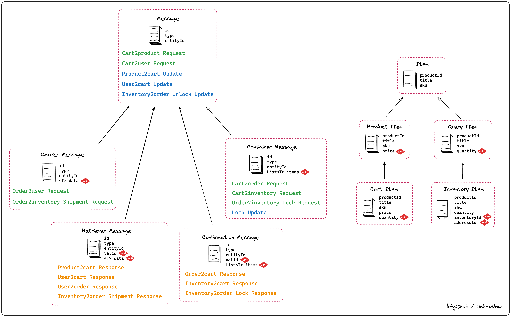

# UnboxNow backend

### The backend of an e-commerce platform, designed for customers' shopping and merchants' operation and maintenance.

## 1. Description

The UnboxNow backend is the backbone of an e-commerce platform, serving customers and merchants. Built on a tech stack featuring Java, Spring Boot, MySQL, Redis, and Kafka, it enables seamless interactions through RESTful APIs and Nginx reverse proxying. With features like asynchronous processing, message queuing, and role-based authorization, it ensures high performance, scalability, and reliability for modern e-commerce operations.

## 2. Table of contents

- [Tech stack](#3-tech-stack)
- [Architecture](#4-architecture)
- [Features](#5-features)
<!-- - [API documentation](#6-api-documentation) -->

## 3. Tech stack

- Language: Java
- Web framework: **Spring Boot**
- DataBase: **MySQL** (Hibernate), NoSQL(Redis), **H2** (for testing)
- Cache: **Redis**
- Message queue: **Apache Kafka** and **Redis**
- Security: tokens (JSON Web Token, **JWT**) for global authentication and role-based authorization, and **Spring security**
- Development: **CI/CD** (GitLab)
- Deployment: **Docker**

## 4. Architecture

The project consists of 5 independent micro-services: Product, Cart, Inventory, User, Order. Communication between micro-services is facilitated through message queue, to process operations asynchronously. Each micro-service connects its own isolated database. 

RESTful APIs are employed for seamless interaction with the frontend, while Nginx servers act as reverse proxies for all microservices.

In terms of security, each microservice seamlessly checks and updates tokens, with only the user part responsible for token issuance. Issued tokens are securely stored in Redis, enhancing security measures.

The decoupled system, using Redis and Kafka to connect each other, is friendly and ready for horizontal scaling.

 

## 5. Features

### 5.1 High concurrency

#### 5.1.1 Asynchronous system

Overall, each independent micro-service, as described in the Architecture section, operates asynchronously, enhancing efficiency and performance. Within each micro-service, functions are tightly integrated, ensuring a cohesive and streamlined operation.

#### 5.1.2 Asynchronous communication

With the help of Redis and Kafka, communication between micro-services is also asynchronous, fostering a loosely coupled design that optimizes system scalability and resilience.

#### 5.1.3 NoSQL database and caching

To further bolster system efficiency and responsiveness, a combination of NoSQL databases and caching mechanisms is employed. The Cart micro-service, as the busiest part in the system, utilizes Redis exclusively as its primary storage solution. Additionally, other micro-services also uses Redis as supplementary storage for frequently accessed data. 

Furthermore,  Redis serves as the caching layer throughout the system, significantly improving data retrieval performance and overall system throughput.

### 5.2 Message queue

The project utilizes Kafka and Redis for implementing the message queue. Redis is chosen for queues requiring faster retrieval and lower reliability, while Kafka is employed for other queues.

 

To cater to various scenarios, the project incorporates specialized message and item objects, ensuring versatility and adaptability in handling different use cases.

 

### 5.3 Authentication and authorization

#### 5.3.1 Authentication using JWT

When users log in or register within the system, the server issues an access token and a refresh token, which are then added as headers in the HTTP response. Simultaneously, the server stores these tokens in Redis for future reference. 

During API calls, the server validates the tokens by parsing them and comparing them with the stored ones. Notably, the access token have a shorter lifespan than the refresh token. When access token expires and refresh token remains valid, the server automatically updates the tokens without needing to involve the user. This mechanism enhances system security by limiting the duration of user authentication sessions.

The user micro-service serves as a authentication center to issue tokens. 

#### 5.3.2 Role-based authorization

When users logs in the system, every micro-service parses the access token and gets the roles of the current user.

Initially, based on the roles of current user, filters within the Spring framework ensure that the fields describing the user id in data transfer objects correspond to the user.

Then, interceptors within the Spring framework validate whether the user possesses adequate permissions to access the endpoint.

#### 5.3.3 Password reset

When a user initiates a "forgot-password" flow, the user micro-service issues a reset token, stores it in Redis and returns it as as a header in the HTTP response. The user can then reset the password by entering the specialized URL that contains the reset token. Reset tokens are validated and compared with stored one during usage.